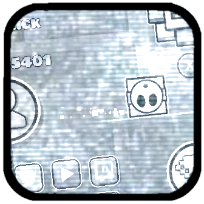

# Main Menu Background Mod

Enhance your game menu with animated/static background. 
This mod lets you easily load GIFs and custom images, 
and adjust settings like scale and position right in-game.

## Features

- **Animated GIFs:** Use animated GIFs for your menu background.
- **Custom Images:** Load your own background images.
- **Easy Configuration:** Tweak scaling and positioning without hassle.
- **Enforce Background and Ground ID:** Force original BG and Ground ID.

---



*Updated logo.png to change mod's icon (rly)*

## Getting started
We recommend heading over to [the getting started section on our docs](https://docs.geode-sdk.org/getting-started/) for useful info on what to do next.

## Build instructions
For more info, see [our docs](https://docs.geode-sdk.org/getting-started/create-mod#build)
```sh
# Assuming you have the Geode CLI set up already
geode build
```

# Resources
* [Geode SDK Documentation](https://docs.geode-sdk.org/)
* [Geode SDK Source Code](https://github.com/geode-sdk/geode/)
* [Geode CLI](https://github.com/geode-sdk/cli)
* [Bindings](https://github.com/geode-sdk/bindings/)
* [Dev Tools](https://github.com/geode-sdk/DevTools)
